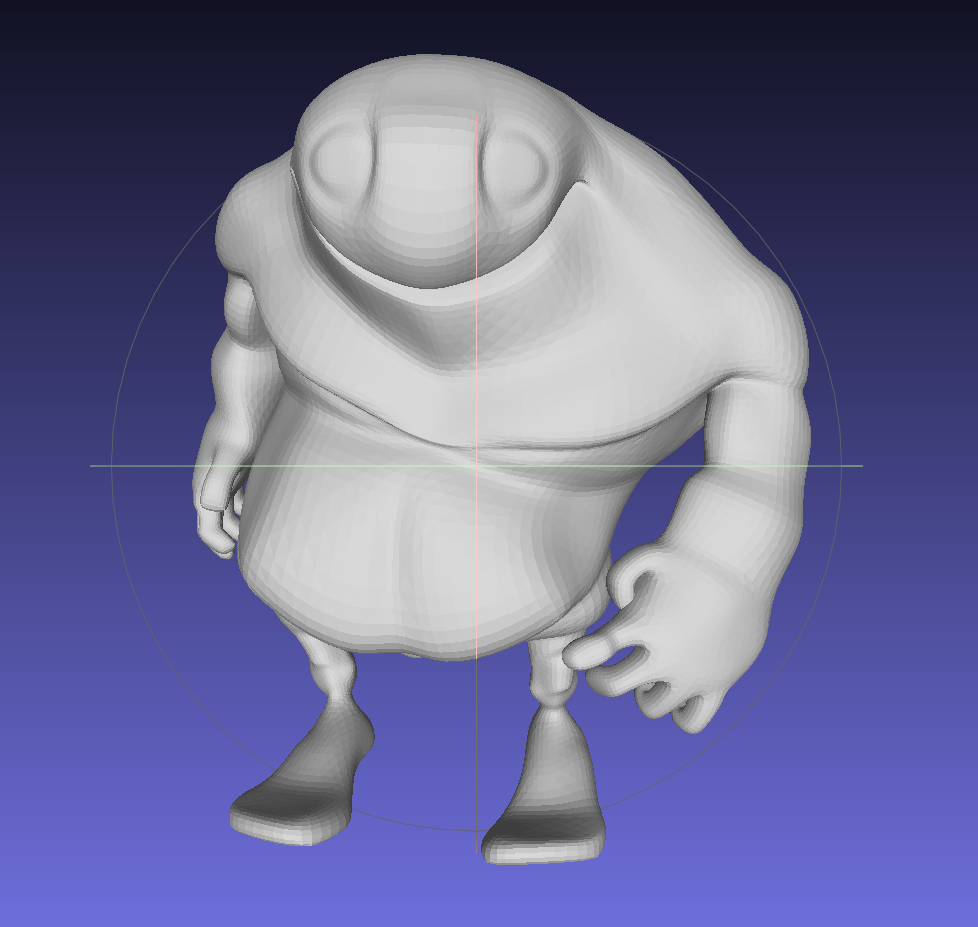

# Simple Polygon
Geometric simplification with half edge data structures and quadratic error metrics.

## Overview
 1. Convert the mesh to half edge representation
 2. Loop all the edge and calculate it's quadratic error，this process is speed up by a simple small heap
 3. Delete the min error edge and rebuild mesh

## Gallery

<table>
    <tr>
        <td>

</td>
        <td>

</td>
    </tr>
</table>

The left side is the original mesh, and right side is simplified mesh which only have 0.05 percents primitives.